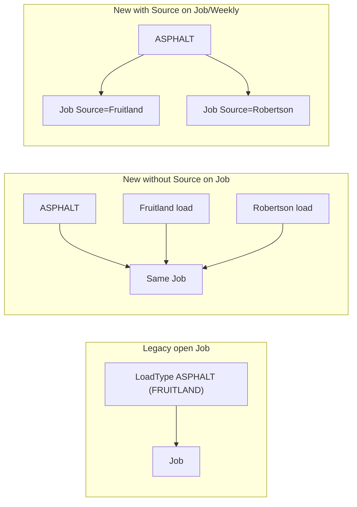

# Aug 2 Sources Migration Cutover Plan (full impact)

## Verdict

Directional plan still works, but a full-site scan shows **more than `Loads.SourceID` is required**. After Source is stripped from LoadType names, **Job/Weekly rematch keys that use only `LoadTypeID` will merge different quarries into one Job/Weekly/invoice line**. Persist **nullable `SourceID` on Loads, Jobs, and Weeklies**, and include it in rematch for new-era work.

Also required: print/display scaffolding everywhere Material is shown, WeeklySheet cascade safety, mass-edit Source, regenerate stale Prisma client, fix `ConsolidatedInvoices` `MaterialTypes` bug.

**Do not build until you explicitly say to build.**

---

## Critical miss: Job / Weekly identity must include Source

Today match keys (`[loads.ts](src/server/router/loads.ts)`):

- Weekly: `CustomerID + Week + DeliveryLocationID + LoadTypeID + rates + open`
- Job: those + `DriverID + DailyID + WeeklyID + rates`

Legacy `ASPHALT (FRUITLAND)` vs `ASPHALT (ROBERTSON)` = different LoadTypeIDs → separate Jobs.  
New pure `ASPHALT` + Source Fruitland vs Robertson = **same LoadTypeID** → **same Job** unless `SourceID` is part of the key.

**Chosen approach:**

| Table      | Change                       |
| ---------- | ---------------------------- |
| `Loads`    | `SourceID Int?` FK → Sources |
| `Jobs`     | `SourceID Int?` FK → Sources |
| `Weeklies` | `SourceID Int?` FK → Sources |

- New-era create/update: when `SourceID` present (or `LoadTypeID >= 10000`), find/create Weekly+Job with matching `SourceID` (treat `null` as its own bucket for non-material types).
- Legacy path (`LoadTypeID < 10000`): leave Job/Weekly `SourceID` null; match as today (source remains in Description).

Without this, September reporting can be right on Loads while **dailies, weeklies, invoices, and paystubs still collapse quarries**.

---

## Logic path matrix (what must change)

### Create load (`loads.put` ← `[Load.tsx](src/components/objects/Load.tsx)`)

| Step        | Today                                  | After plan                                                 |
| ----------- | -------------------------------------- | ---------------------------------------------------------- |
| Form fields | Source select commented out            | Uncomment on new-era; hide when continuing open legacy Job |
| Rematch     | Daily → Weekly → Job by LoadType+rates | Same + `SourceID` for new-era                              |
| PaidOut     | Create excludes `PaidOut` jobs         | Keep                                                       |
| Persist     | Strips `SourceID`                      | Write `Loads.SourceID`; set Job/Weekly `SourceID`          |
| Side writes | CustomerLoadTypes, trucksDriven, CDL   | Keep; upsert SourceLoadTypes                               |
| Open-Job UX | None                                   | Banner + OpenJob LoadType group + progressive table        |

### Edit load (`loads.post` → `updateLoadAndRelations`)

| Step                                             | Today                                                 | After plan                                                         |
| ------------------------------------------------ | ----------------------------------------------------- | ------------------------------------------------------------------ |
| Rematch                                          | **Always** runs (no dirty check)                      | Keep; add SourceID to keys                                         |
| PaidOut                                          | Can attach to paid-out job (warnings are empty stubs) | Align with create: do not attach to PaidOut; surface real warnings |
| SourceID                                         | Stripped                                              | Persist; rematch if Source changes                                 |
| CustomerLoadTypes                                | Not written on edit                                   | Optional: upsert when LoadType changes (recommend groups)          |
| SSR `[loads/[id].tsx](src/pages/loads/[id].tsx)` | No Sources include                                    | Include `Sources`                                                  |

Changing LoadType from legacy → new (or Source change) creates a **new** Job/Weekly and leaves the old Job with remaining loads (existing orphan behavior; do not silent-delete).

### Mass edit (`post_mass_edit` ← `[PartialLoad.tsx](src/components/objects/PartialLoad.tsx)` + `[massedit.tsx](src/pages/loads/massedit.tsx)`)

| Risk                                                   | Mitigation                                                                       |
| ------------------------------------------------------ | -------------------------------------------------------------------------------- |
| One rematch → **one JobID for all selected IDs**       | Keep; require selected loads share era / block mixed legacy+new in one mass edit |
| Whitelist omits SourceID                               | Add `SourceID` to `updateMany` data when provided                                |
| No Source field / uses `Description` not `DisplayName` | Add Source on new-era mass edit; use DisplayName                                 |
| Can paint new LoadType onto legacy open Jobs           | Validate: if any selected load’s Job is legacy-open, only allow legacy LoadTypes |

### Weekly edit cascade (`[weeklies.post](src/server/router/weeklies.ts)` ← `[WeeklySheet.tsx](src/components/objects/WeeklySheet.tsx)`)

**High risk:** updates `CustomerID` / `LoadTypeID` / `DeliveryLocationID` on **all Jobs + Loads** for that Weekly — **no rematch, no SourceID**.

| Required                                                                                                                       |
| ------------------------------------------------------------------------------------------------------------------------------ |
| Cascade `SourceID` if column added on Weeklies                                                                                 |
| Block changing LoadType from legacy ↔ new catalog on a Weekly that still has loads (force per-load rematch instead)            |
| Warn that Source is part of Weekly identity for new-era sheets                                                                 |
| Weekly LoadType autocomplete today is BasicAutocomplete (no Source ranking) — upgrade or keep Description-only for weekly edit |

### Daily / Job close / PayStub

| Path                                                                    | Impact                                                                             |
| ----------------------------------------------------------------------- | ---------------------------------------------------------------------------------- |
| `[jobs.postClosed` / `postPaid](src/server/router/jobs.ts)`             | Revenue/PaidOut only — OK; display Job material should show Source                 |
| `[DailySheet](src/components/objects/DailySheet.tsx)` close             | OK; Material cell needs Source display                                             |
| Pay stubs / `[PayStubJobs](src/components/collections/PayStubJobs.tsx)` | Description concat needs Source ShortName                                          |
| Load delete                                                             | Hard delete; Jobs/Weeklies orphan — existing issue; dual-catalog increases orphans |

### Invoice create/delete (`[invoices.ts](src/server/router/invoices.ts)`)

| Path                                  | Impact                                                                          |
| ------------------------------------- | ------------------------------------------------------------------------------- |
| Marks loads Invoiced + InvoiceID only | OK                                                                              |
| Invoice line text                     | Raw `LoadTypes.Description` — **must append Source** for new-era weeklies/loads |
| If Weekly keyed by Source             | Separate invoice lines per quarry automatically                                 |

### Autocomplete / search

| Surface                                              | Gap                                                                              |
| ---------------------------------------------------- | -------------------------------------------------------------------------------- |
| `[loadtypes.search](src/server/router/loadtypes.ts)` | No `Deleted` filter; no era filter; returns mixed catalogs                       |
| `[RHAutocomplete](src/elements/RHAutocomplete.tsx)`  | Source-aware — Load form only                                                    |
| `[BasicAutocomplete](src/elements/Autocomplete.tsx)` | WeeklySheet, loads filters, invoice filters — Description only                   |
| CustomerLoadTypes / SourceLoadTypes affinity         | After cutover, recommendations stick to legacy IDs until usage builds on new IDs |

### Prisma client drift

`[prisma/generated/client](prisma/generated/client)` still models `LoadTypes.SourceID` and may lack live Sources models. **Regenerate after schema change** before trusting staging.

---

## Print / display inventory (show `ShortName || Name` when Source present)

**Pattern:** Material cell = `{LoadTypes.Description}` + optional  `({Sources.ShortName || Sources.Name})` when `SourceID` set. Reuse loadtypes search DisplayName convention. Prefer ShortName on dense PDFs.

### PDF / print APIs

| File                                                                           | Today                                      | Change                                       |
| ------------------------------------------------------------------------------ | ------------------------------------------ | -------------------------------------------- |
| `[getPDF/invoice/[ID].js](src/pages/api/getPDF/invoice/[ID].js)`               | Includes LoadTypes                         | Include Sources on Weeklies + Loads          |
| `[InvoiceParts/TableRow.tsx](src/elements/InvoiceParts/TableRow.tsx)`          | Description only (weekly + load)           | Append Source                                |
| `[getPDF/daily/[ID].js](src/pages/api/getPDF/daily/[ID].js)`                   | Job LoadTypes                              | Include Job.Sources (or Loads)               |
| `[DailyParts/TableRow.tsx](src/elements/DailyParts/TableRow.tsx)`              | Material = Description                     | Append Source                                |
| `[getPDF/weekly/[ID].js](src/pages/api/getPDF/weekly/[ID].js)`                 | LoadTypes                                  | Include Sources                              |
| `[WeeklySheetFull.tsx](src/components/objects/WeeklySheetFull.tsx)`            | Title material = Description               | Append Source                                |
| `[getPDF/paystub/[ID].js](src/pages/api/getPDF/paystub/[ID].js)`               | LoadTypes.Description in formatDescription | Append Source                                |
| `[PayStubParts/TableRow.tsx](src/elements/PayStubParts/TableRow.tsx)`          | Same                                       | Same                                         |
| `[getPDF/report/[ID].js](src/pages/api/getPDF/report/[ID].js)`                 | Filters via SourceLoadTypes junction       | Filter by `Loads.SourceID`; header ShortName |
| `[getPDF/reportCustomer/[ID].js](src/pages/api/getPDF/reportCustomer/[ID].js)` | No Source column                           | Add Source                                   |

### On-screen sheets / lists / forms

| File                                                                                                                                        | Change                                                                                  |
| ------------------------------------------------------------------------------------------------------------------------------------------- | --------------------------------------------------------------------------------------- |
| `[DailySheet.tsx](src/components/objects/DailySheet.tsx)`                                                                                   | Material + Source                                                                       |
| `[WeeklySheet.tsx](src/components/objects/WeeklySheet.tsx)`                                                                                 | Accordion title + “Material Delivered”                                                  |
| `[InvoiceLoads.tsx](src/components/collections/InvoiceLoads.tsx)` / `[InvoiceWeeklies.tsx](src/components/collections/InvoiceWeeklies.tsx)` | Type/Material + Source                                                                  |
| `[ConsolidatedInvoices.tsx](src/components/collections/ConsolidatedInvoices.tsx)`                                                           | **Bug:** uses `load.MaterialTypes` — fix to `LoadTypes` + Source                        |
| `[PayStubJobs.tsx](src/components/collections/PayStubJobs.tsx)`                                                                             | Mirror paystub PDF                                                                      |
| `[loads/index.tsx](src/pages/loads/index.tsx)` / massedit grid                                                                              | Optional Source column or combined DisplayName                                          |
| `[customers/[id].tsx](src/pages/customers/[id].tsx)` loads tab                                                                              | Optional Source                                                                         |
| `[Load.tsx](src/components/objects/Load.tsx)`                                                                                               | Uncomment Source; DisplayName already partially wired                                   |
| `[Source.tsx](src/components/objects/Source.tsx)`                                                                                           | **Add ShortName field** (schema has it; form does not) — needed for print abbreviations |
| `[Sidenav.tsx](src/components/layout/Sidenav.tsx)`                                                                                          | Uncomment Sources + Reports                                                             |

### Reports UI

| File                                                                | Change                                                                        |
| ------------------------------------------------------------------- | ----------------------------------------------------------------------------- |
| `[reports.ts](src/server/router/reports.ts)` `sourceAudit`          | Prefer `Loads.SourceID == input` (junction fallback for legacy null SourceID) |
| `customerAudit`                                                     | Include Source per row                                                        |
| `[AuditReportPage.tsx](src/components/objects/AuditReportPage.tsx)` | Customer mode Source column                                                   |

Helper (shared): `formatMaterial(loadOrJob)` → Description + optional `(ShortName||Name)` to avoid N copy-paste bugs.

---

## Open-Job UX (locked)

**Both:**

1. LoadType recommend group `OpenJob` (primary)
2. Progressive open-Jobs table below (click = prefill)
3. Banner + “New work instead” escape hatch

Predict from Driver+Week (+ Customer/Location). Do not hard-lock form to legacy-only.

---

## LoadType naming + client CSVs

Keep service tags; strip Source; dedupe:

- `ASPHALT` / `ASPHALT (HOURLY)` / `DIRT (HAULING)` / `AGLIME (SPREADING ONLY)`
- Never `ASPHALT (FRUITLAND)` in the new catalog

On approval, write:

- `prisma/migration-data/client-review/seed_loadtypes_with_services.csv`
- `prisma/migration-data/client-review/seed_sources.csv` (Name, ShortName, AliasTags, …)

---

## Explosion / regression checklist

1. Job/Weekly without SourceID → mixed-quarry jobs/invoices
2. Strip SourceID still in loads router → silent data loss
3. Mass-edit one JobID across mixed eras
4. WeeklySheet LoadType cascade across catalogs
5. Create vs edit PaidOut mismatch
6. Soft-delete + search ignoring Deleted
7. Re-pollute 10000+ with parenthetical Sources via “New Load Type”
8. Stale Prisma client
9. Print paths still Description-only → customers/drivers see material without quarry
10. Source form missing ShortName → ugly/full names on PDFs
11. ConsolidatedInvoices MaterialTypes bug (already broken)
12. CustomerLoadTypes affinity stuck on legacy IDs
13. Orphan Jobs/Weeklies after rematch (existing; monitor)
14. Reports still junction-based after multi-source materials
15. Invoice filters / BasicAutocomplete never show DisplayName

---

## Implementation order (when you say build)

1. Client seed CSVs (proofread)
2. Schema: SourceID on Loads + Jobs + Weeklies; regenerate client; Source.ShortName in UI
3. Rematch + persist + mass-edit whitelist + weeklies cascade guards
4. Open-Job UX + Source select + search era/Deleted
5. Shared `formatMaterial` + all print/display + reports
6. Uncomment sidenav
7. Staging full-path rehearsal → Aug 2 prod

---

## Direct answers

- **Thorough scan?** Covered create/edit/mass-edit, weekly cascade, invoice/paystub/daily/weekly PDF + on-screen, reports, autocomplete, Prisma drift, ConsolidatedInvoices bug.  
- **Biggest miss previously?** Source must participate in **Job/Weekly** identity, not only Loads — or stripping Source from LoadType names collapses quarries in accounting docs.  
- **Print scaffolding?** Explicit inventory above; shared formatter + include Sources in every getPDF query.  
- **Build?** Not until you specifically say to build.

