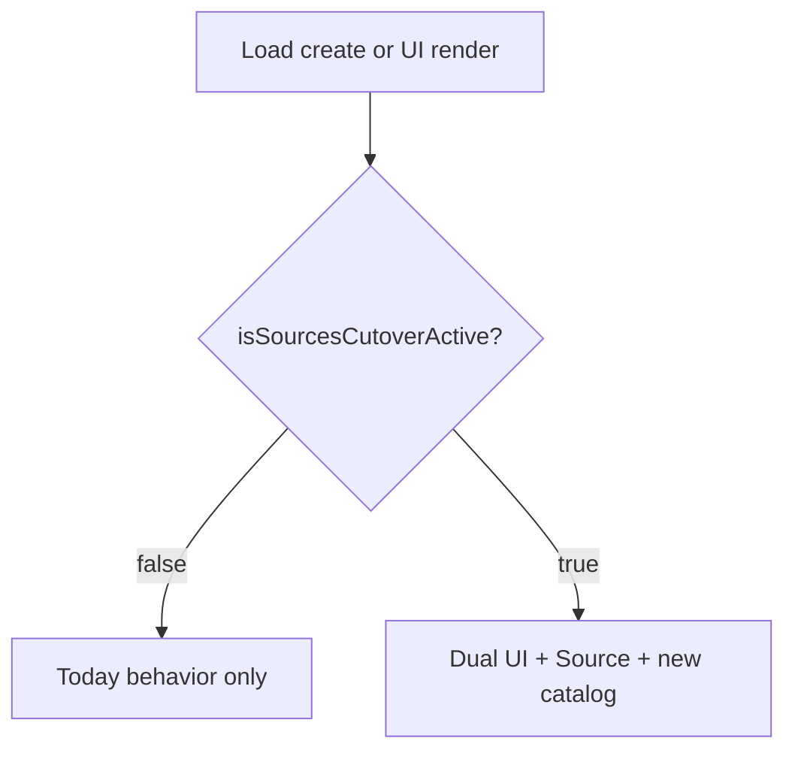
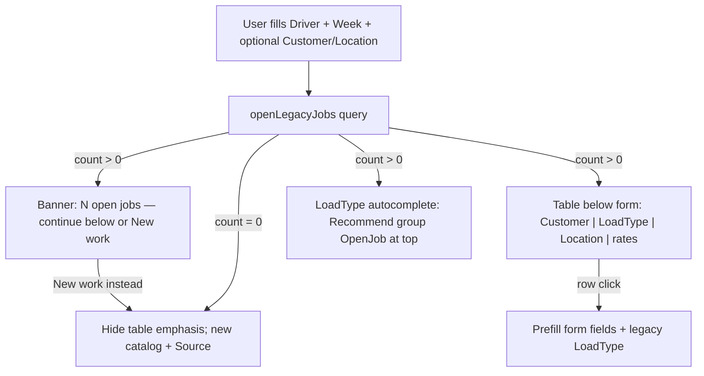

# Aug 2 Sources Migration Cutover Plan

**Status: plan mode.** User approved specific scaffolding items (ShortName, formatMaterial, BasicAutocomplete, Loads.SourceID reports) for implementation when build starts. Not building yet.

---

## User decisions (latest)

| Decision | Choice |
|----------|--------|
| Source form | Add **ShortName** field |
| Print/display | Create shared **`formatMaterial`** helper |
| ConsolidatedInvoices | **Defer** (known MaterialTypes bug; revisit later) |
| Reports | Filter by **`Loads.SourceID`** (not SourceLoadTypes junction) |
| BasicAutocomplete | **Fix** — pass CustomerID / SourceID / era like RHAutocomplete |
| Era mixing | **Not a hard concern** — `LoadTypeID < 10000` = legacy, `>= 10000` = new; pre-Aug Jobs naturally use legacy IDs |
| Open-Job UI | **Both** LoadType OpenJob recommend + progressive table + banner (see below) |
| Cutover gate | **Global cutover date** — nothing customer-visible until Aug 2 (overridable for testing); code can deploy earlier |

---

## Cutover date gate (deploy early, activate Aug 2)

Code will ship **before** Aug 2, but **customers must see zero change** until the cutover date. Single config module controls this; removable after migration completes.

### Config module (single source of truth)

**File:** [`src/config/sourcesCutover.ts`](src/config/sourcesCutover.ts) (new)

```ts
// Default: Sunday Aug 2, 2026 00:00 America/Chicago
export const SOURCES_CUTOVER_DATE_DEFAULT = '2026-08-02T00:00:00-05:00';

export function getSourcesCutoverDate(): Date {
  const raw = process.env.SOURCES_CUTOVER_DATE ?? SOURCES_CUTOVER_DATE_DEFAULT;
  return new Date(raw);
}

/** All cutover behavior is off until this returns true. */
export function isSourcesCutoverActive(now: Date = new Date()): boolean {
  // Staging/local testing only — set SOURCES_CUTOVER_FORCE=true in .env
  if (process.env.SOURCES_CUTOVER_FORCE === 'true') return true;
  return now >= getSourcesCutoverDate();
}
```

**Env vars** (add to [`src/env/schema.mjs`](src/env/schema.mjs) when implementing):

| Variable | Purpose |
|----------|---------|
| `SOURCES_CUTOVER_DATE` | Optional override of default `2026-08-02` (e.g. set to `2026-07-01` on staging to test early) |
| `SOURCES_CUTOVER_FORCE` | `true` = cutover active immediately regardless of date (local/staging only; never prod) |
| `NEXT_PUBLIC_SOURCES_CUTOVER_DATE` | Optional client mirror if UI needs the date without a round-trip (or expose via tRPC `config.isSourcesCutoverActive`) |

**Testing workflow:**

- **Prod before Aug 2:** no env overrides → `isSourcesCutoverActive()` is false → app identical to today.
- **Staging:** set `SOURCES_CUTOVER_DATE=2026-01-01` or `SOURCES_CUTOVER_FORCE=true` → full cutover UX without waiting.
- **After migration done (~Sept+):** delete `sourcesCutover.ts`, env vars, and all `if (isSourcesCutoverActive())` branches (or leave date in past).

### What the gate controls (everything customer-facing)

When `isSourcesCutoverActive()` is **false**, behave exactly as production does today:

| Surface | Gated behavior |
|---------|----------------|
| Load form | No open-Jobs banner/table; no OpenJob LoadType group; Source select stays hidden; loadtypes search returns **legacy only** (no `ID >= 10000` default) |
| Sidenav | Sources + Reports links stay hidden (even if code is uncommented, wrap in gate) |
| `loadtypes.search` | No era=new; no OpenJob recommend injection |
| `loads` router | Do not persist `SourceID`; do not apply new-era rematch keys; reject `LoadTypeID >= 10000` if any exist pre-seed |
| Reports (new Source audit UI) | Routes unreachable or redirect |
| Sources admin pages | Optional: 404 or hidden nav until active |

When **true** (Aug 2+ or test override): full plan behavior.

### What can ship ungated (safe before Aug 2)

These do not change customer experience until data + gate flip:

- Schema columns (`SourceID` nullable) — no UI writes them pre-cutover
- `formatMaterial` helper — no-op when `source` is null (legacy rows)
- Source `ShortName` field — only visible if user navigates to `/sources` (gate nav too)
- BasicAutocomplete wiring — inert until cutover search params used

### Server + client must both check

Client-only gating is not enough (direct API calls). **Mirror the check** in tRPC routers (`loads`, `loadtypes`, `reports`) using the same `isSourcesCutoverActive()` import.



---

## The problem (why we're doing this)

Today's `LoadTypes` table is polluted: duplicates, typos, and **Source embedded in the name** (`ASPHALT (FRUITLAND)`, `1" MINUS (WS)`). That made sense historically but blocks clean reporting like *"How much Asphalt from Fruitland went to James Spader's Garage?"*

The client agreed **not** to remap all historical data. Instead:

- **Aug 2, 2026:** Start using a clean catalog (Sources table + deduped LoadTypes).
- **Legacy LoadTypes stay** so staff can finish open Jobs started before the switch.
- **September goal:** All *new* work uses clean data; legacy open Jobs should be closed by then.

---

## What we're building (high level)

### 1. New `Sources` table (insert before/at cutover)

Canonical quarries/plants: Fruitland, WS, ICM Doniphan, etc. Each has `Name` + optional `ShortName` (for invoices/PDFs).

### 2. New clean `LoadTypes` at ID >= 10000

- **Strip Source** from the name (`ASPHALT (FRUITLAND)` → `ASPHALT`).
- **Keep service tags** in the name: `ASPHALT (HOURLY)`, `DIRT (HAULING)`, `AGLIME (SPREADING ONLY)`.
- Dedupe on that pure name.
- Set `ALTER TABLE LoadTypes AUTO_INCREMENT = 10000` so new rows don't collide with legacy IDs 1–521.

### 3. `Loads.SourceID` (and Jobs/Weeklies for rematch)

Store which Source each load came from. Required for accurate post-cutover reporting and printing.

Also add `SourceID` to **Jobs** and **Weeklies** and include it in rematch keys when `LoadTypeID >= 10000`. Otherwise two quarries hauling the same material to the same place collapse into one Job/invoice line.

Legacy loads (`LoadTypeID < 10000`) keep Source in the old Description; `SourceID` stays null.

### 4. Dual UI on the Load form

**Same component everywhere:** [`Load.tsx`](src/components/objects/Load.tsx) is used on:

- Dashboard — [`src/pages/index.tsx`](src/pages/index.tsx)
- Create loads — [`src/pages/loads/index.tsx`](src/pages/loads/index.tsx)
- Edit load — [`src/pages/loads/[id].tsx`](src/pages/loads/[id].tsx)

One implementation covers all entry points.

**Rule:** If the load would attach to an **open legacy Job**, use old UI (legacy LoadType, no Source). If it would **create a new Job**, use new UI (clean LoadType + Source).

Era is naturally separated by LoadType pkey (`< 10000` vs `>= 10000`); no heavy "block mixing eras" validation needed.

### 5. Open-Job UX (locked — how we display matching open Jobs)

When the user fills Driver + Week (and optionally Customer / Delivery Location), query **open legacy Jobs** for that driver-week:

- `PaidOut != true`
- Weekly `InvoiceID IS NULL` (still billable)
- Job's `LoadTypeID < 10000`

**Three surfaces (all on the same Load form):**



| Surface | Role |
|---------|------|
| **Status banner** | "3 open jobs for this driver/week" + link **"New work instead"** (escape hatch for same-day new catalog work) |
| **LoadType recommend group `OpenJob`** | LoadTypes from matching open Jobs float to top of picker (above Customer/Source/Other) — fast path for operators who know the type |
| **Progressive table below the form** | Columns: Customer, LoadType description, Delivery location, key rates. **Narrows** as Customer/Location are filled. **Click row** → prefill all Job-matching fields so create attaches to that Job |

**Why both autocomplete + table?**

- Autocomplete alone fails when two open Jobs share a LoadType but differ by location/rates.
- Table alone is easy to ignore; operators live in the Load Type field.

**New-era path (no open legacy Jobs, or user clicks "New work"):**

- LoadType picker defaults to `ID >= 10000` catalog.
- **Source** select visible (currently commented out in Load.tsx).
- Source required when material needs provenance (optional denylist for WAITING TIME, SHOP HOURS, etc.).

### 6. Printing & display scaffolding

Shared helper: **`formatMaterial({ description, source })`** → `ASPHALT (FRUIT)` when ShortName exists.

Use on: invoice PDFs, daily/weekly sheets, pay stubs, load lists, invoice pickers, audit reports.

**Approved now (when build starts):** ShortName on Source form, formatMaterial helper, BasicAutocomplete fixes, reports on Loads.SourceID.

**Deferred:** ConsolidatedInvoices MaterialTypes bug.

### 7. Uncomment nav

Sources admin + Reports (currently commented in Sidenav).

---

## How Job attach works (drives open-Job detection)

From [`loads.ts`](src/server/router/loads.ts):

1. Find/create **Daily** for `DriverID + Week`.
2. Find/create **Weekly** for `CustomerID + Week + DeliveryLocationID + LoadTypeID + CompanyRate + open`.
3. Find/create **Job** on that Daily/Weekly matching rates.

Changing **LoadType** changes which Job you land in. Legacy `ASPHALT (FRUITLAND)` (ID 116) and new `ASPHALT` (ID 10000+) are **different Jobs**.

---

## CSV files — where they live and what gets inserted

### Existing analysis (reference / parser output)

All under [`prisma/migration-data/client-review/`](prisma/migration-data/client-review/):

| File | Purpose |
|------|---------|
| `00_summary.json` | Counts: 250 bases, 96 source tags, etc. |
| `01_load_type_bases.csv` | Deduped material names (Source stripped) |
| `02_sources_for_client.csv` | 96 source tags with load counts |
| `03_services_for_client.csv` | HOURLY, HAULING, SPREADING ONLY, etc. |
| `04_hourly_detail_tags.csv` | Hourly variants |
| `05_duplicate_groups.csv` | Dupes to merge |
| `06_weird_or_review.csv` | Client review flags |
| `07_full_migration_preview.csv` | Full legacy → proposed mapping |

Raw dump: [`prisma/migration-data/LoadTypes.csv`](prisma/migration-data/LoadTypes.csv) (519 rows, IDs 1–521).

### Client proofread / insert packs (to be generated — **not written yet**)

Will be created at:

- **`prisma/migration-data/client-review/seed_sources.csv`**  
  Columns: `Name`, `ShortName`, `TotalLoadCount`, `AliasTags`, `ClientAction`, `Notes`  
  ~55 canonical Sources after merge (over-include for client to delete false positives).

- **`prisma/migration-data/client-review/seed_loadtypes_with_services.csv`**  
  Columns: `ProposedDescription`, `TotalLoadCount`, `ExampleLegacyDescriptions`, `ClientAction`, `Notes`  
  ~260 unique names: material ± service tag, **never** Source in parentheses.  
  Examples: `ASPHALT`, `ASPHALT (HOURLY)`, `DIRT (HAULING)`, `AGLIME (SPREADING ONLY)`.

**Insert process (Aug 2 prod):**

1. Client proofreads and marks KEEP/DELETE on those two seed CSVs.
2. `INSERT INTO Sources` from approved `seed_sources.csv`.
3. `ALTER TABLE LoadTypes AUTO_INCREMENT = 10000`.
4. `INSERT INTO LoadTypes (Description, …)` from approved `seed_loadtypes_with_services.csv` (IDs auto-assign 10000+).
5. Deploy app with dual UI + SourceID schema.

Legacy rows IDs 1–521 are **not** deleted on Aug 2.

---

## What changes in the app (summary)

| Area | Change |
|------|--------|
| Schema | `SourceID` on Loads, Jobs, Weeklies |
| Load create/edit | Persist SourceID; rematch includes Source for new-era |
| Load form (dashboard + /loads) | Open-Job banner + table + OpenJob LoadType group; Source select for new work |
| Source admin | ShortName field on form |
| loadtypes.search | Era filter, Deleted filter, OpenJob recommend |
| BasicAutocomplete | Pass CustomerID/SourceID like RHAutocomplete |
| Reports | `Loads.SourceID` filter |
| All prints/lists | `formatMaterial()` |
| Sidenav | Sources + Reports uncommented |
| ConsolidatedInvoices | **No change** (deferred) |

---

## Timeline

| When | What |
|------|------|
| Before Aug 2 | Generate seed CSVs → client proofread → staging rehearsal |
| **Before Aug 2** | Deploy code with cutover gate **off** (default date); test on staging with `SOURCES_CUTOVER_FORCE` or past date |
| **Sun Aug 2** | Insert Sources + LoadTypes @ 10000; gate turns on automatically at midnight (or set `SOURCES_CUTOVER_DATE` if deploy lags) |
| Aug–Sept | Dual-run: finish legacy open Jobs on old LoadTypes |
| ~September | Soft-delete unused legacy LoadTypes when open Jobs clear |

---

## Implementation order (when user says build)

1. **`sourcesCutover.ts` + env schema** — gate first so partial work cannot leak to prod
2. Generate `seed_sources.csv` + `seed_loadtypes_with_services.csv`
3. Approved scaffolding: Source ShortName, formatMaterial, BasicAutocomplete, reports Loads.SourceID (all respect gate where customer-visible)
4. Schema SourceID + rematch + persist (server writes gated)
5. Open-Job UX on Load.tsx (dashboard + /loads share it, behind gate)
6. Print/display via formatMaterial (skip ConsolidatedInvoices)
7. Staging with `SOURCES_CUTOVER_FORCE=true` → prod deploy pre-Aug 2 with gate off → Aug 2 data insert
